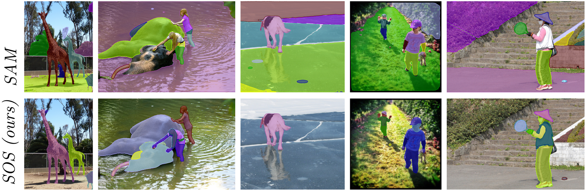
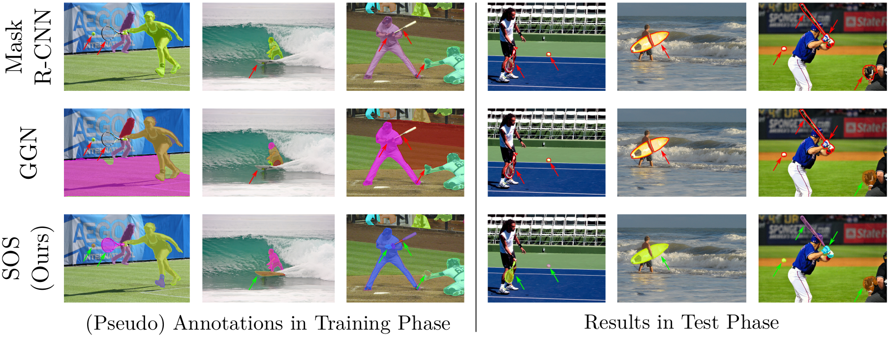

# SOS: Segment Object System for Open-World Instance Segmentation With Object Priors

[Christian Wilms](https://www.inf.uni-hamburg.de/en/inst/ab/cv/people/wilms.html), [Tim Rolff](https://www.inf.uni-hamburg.de/en/inst/ab/cv/people/rolff.html), Maris Hillemann, [Robert Johanson](https://github.com/RbtJhs), [Simone Frintrop](https://www.inf.uni-hamburg.de/en/inst/ab/cv/people/frintrop.html)

This repository contains the code of our ECCV'24 paper **SOS: Segment Object System for Open-World Instance Segmentation With Object Priors** including the SOS system and the study on object-focused SAM. For the **results and pre-trained models**, check the tables below.

[[Paper](https://fiona.uni-hamburg.de/a3c1f3ec/wilms-etal-eccv-2024.pdf)], [[Supplementary Material](https://fiona.uni-hamburg.de/a3c1f3ec/wilms-etal-eccv-2024-supp-mat.pdf)], [[Video](https://youtu.be/ASN9UI9M3NU)]

The **Segment Object System (SOS)** is an open-world instance segmentation system capable of segmenting arbitrary objects in scenes. It utilizes rich pre-trained DINO self-attention maps as object priors to roughly localize unannotated objects in a training dataset. Subsequently, it applies the modern Segment Anything Model (SAM) to produce pseudo annotations from these rough localizations. Finally, a vanilla Mask R-CNN system is trained on original and pseudo annotations to provide strong generalization ability to unannotated objects. Note that a key difference to vanilla SAM is the focus of SOS on objects and not all coherent regions. 

Overall, SOS produces new state-of-the-art results on several open-world instance segmentation setups, showing strong generalization from annotated objects in training to unannotated objects during testing.

More to come in mid-September. Stay tuned!
